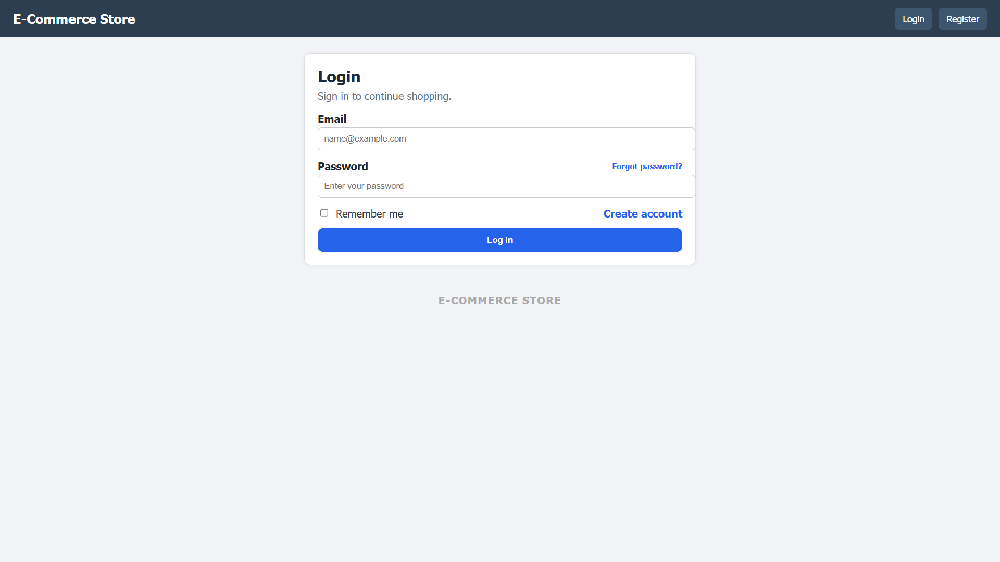
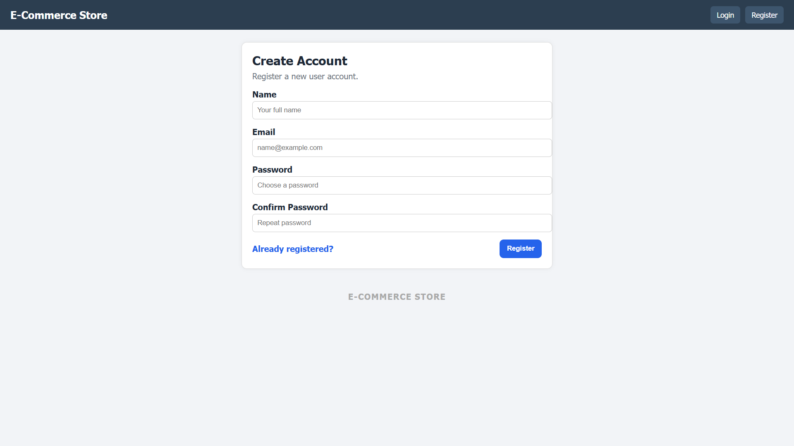
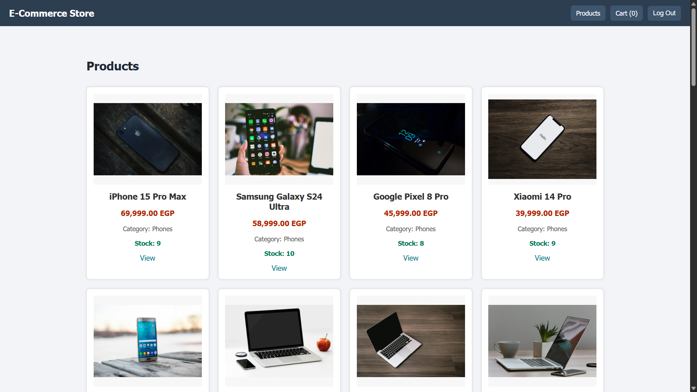
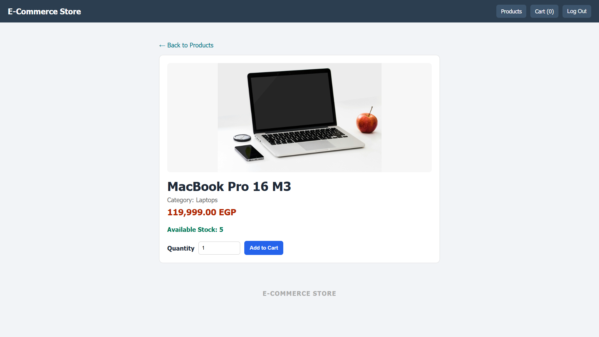
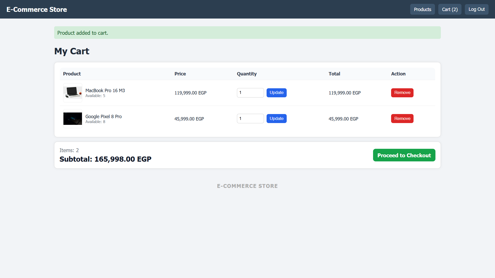
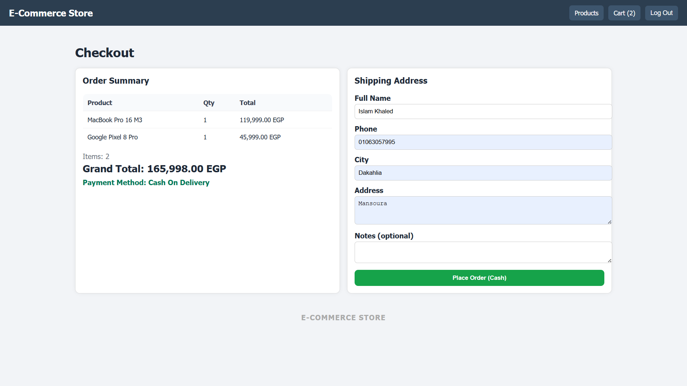
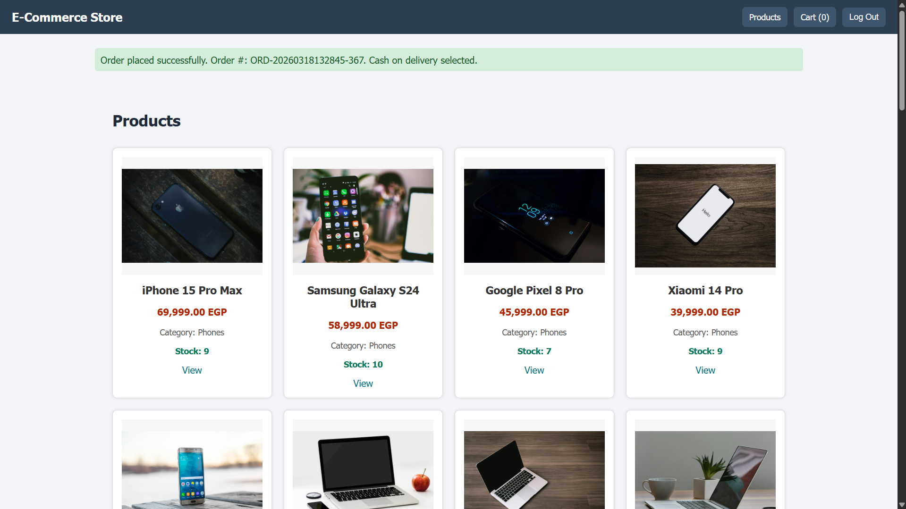
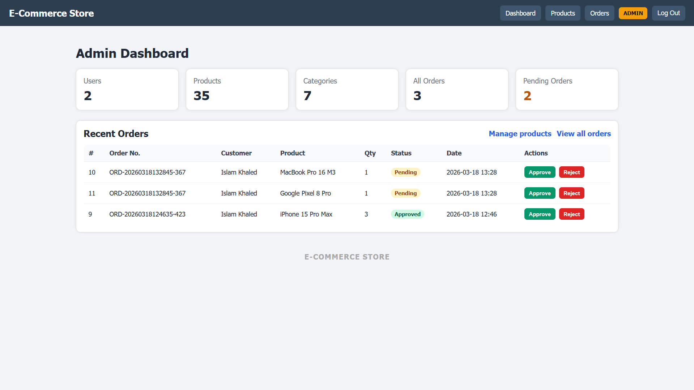
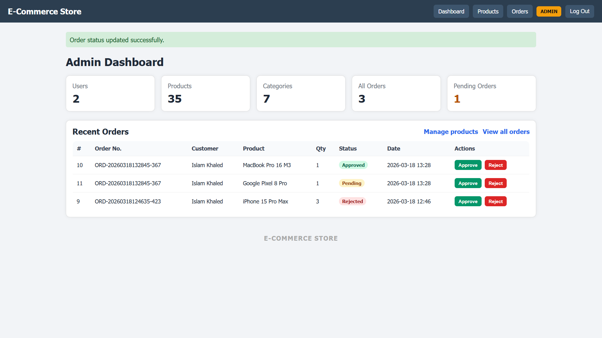
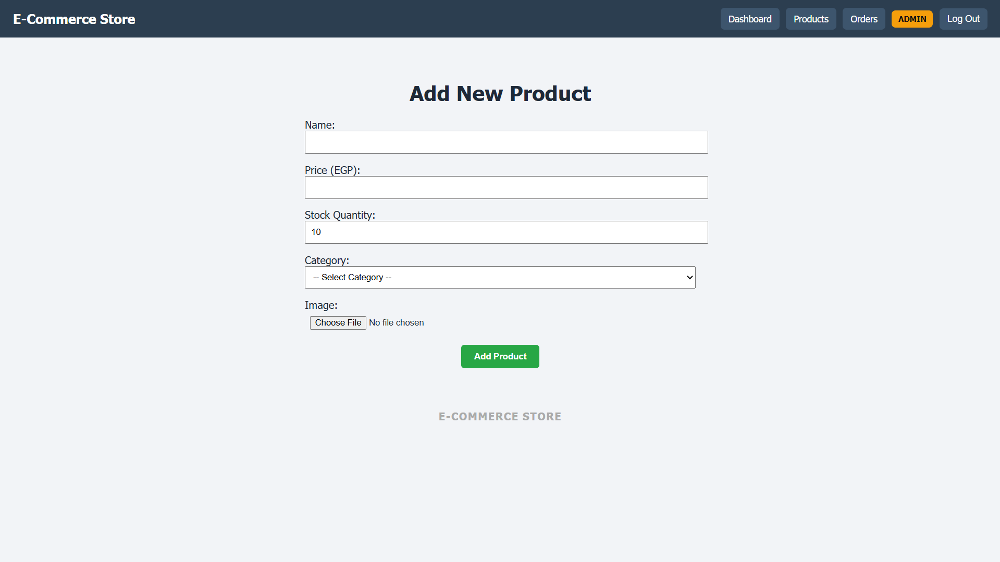

# Laravel E-Commerce Store

Simple internship-ready e-commerce project built with Laravel (PHP) and Blade.

## Features

- Authentication (login, register, password reset, email verification)
- Two roles:
	- Admin: dashboard, product management, order management
	- User: browse products, cart, checkout, reorder previous items
- Cart and checkout flow (cash on delivery)
- Shipping details saved with each order
- Order number grouping
- Stock validation and automatic stock decrement on checkout
- Basic test suite with Pest

## Tech Stack

- PHP 8.2+
- Laravel 12
- Blade templates
- SQLite (default local setup)
- Vite (frontend assets)

## Project Docs

- Route map: [docs/ROUTES.md](docs/ROUTES.md)
- Deployment guide: [docs/DEPLOYMENT.md](docs/DEPLOYMENT.md)

## Screenshots

### Login



### Register



### Products (User)



### Product Details



### Cart



### Checkout



### Order Success



### Admin Dashboard



### Orders Management (Admin)



### Products Management (Admin)



## Local Setup

1. Clone the repository:

```bash
git clone https://github.com/islamkhaled1/laravel-ecommerce-store.git
cd laravel-ecommerce-store
```

2. Install dependencies:

```bash
composer install
npm install
```

3. Configure environment:

```bash
cp .env.example .env
php artisan key:generate
```

4. Prepare database (SQLite):

```bash
mkdir -p database
type nul > database/database.sqlite
```

5. Run migrations and seeders:

```bash
php artisan migrate --seed
```

6. Run the app:

```bash
php artisan serve
npm run dev
```

App URL: http://127.0.0.1:8000

## Demo Accounts

Admin account is seeded by default:

- Email: admin@example.com
- Password: 12345678

Important: change this password in any non-local environment.

You can register normal users from the Register page.

## Routing Notes

- `/` redirects to `/login`
- Admin-only dashboard: `/dashboard`
- Products page for all authenticated users: `/products`

## Run Tests

```bash
php artisan test
```

## Build Assets For Production

```bash
npm run build
```

## Minimal Deploy Checklist

- Set `APP_ENV=production`
- Set `APP_DEBUG=false`
- Set a real `APP_KEY`
- Set correct `APP_URL`
- Configure database credentials
- Configure `SESSION_DRIVER` and `CACHE_STORE`
- Run:

```bash
php artisan migrate --force
php artisan config:cache
php artisan route:cache
php artisan view:cache
```

## License

This project is open-sourced under the MIT license.
